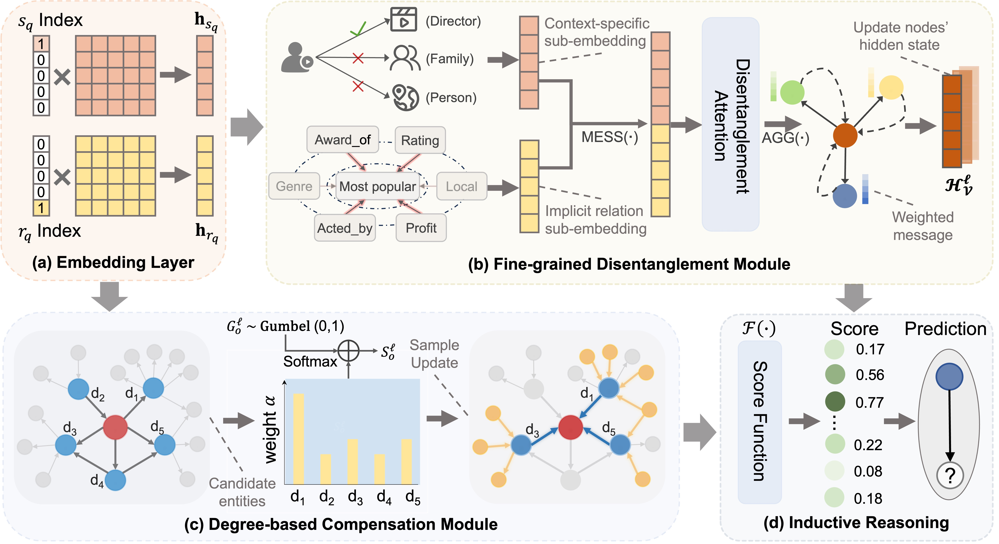

# FinD-GNN: Fine-grained Disentanglement Graph Network for Inductive Knowledge Graph Reasoning

## Introduction
Inductive Knowledge Graph Reasoning (IKGR) is essential for deriving new knowledge from existing relationships within knowledge graphs.  However, existing methods often fall short in capturing the complexities and implicit connections of real-world data, limiting their reasoning capabilities.

In this work, we introduce FinD-GNN, a novel Graph Neural Network (GNN) tailored for IKGR. FinD-GNN introduces two key innovations: fine-grained disentanglement and degree-based compensation. Extensive experiments demonstrate FinD-GNN's efficiency and accuracy in IKGR, showcasing its ability to provide state-of-the-art performance while maintaining a focus on semantic relevance and adaptive reasoning.

## Overview

<p align="center">
   
</p>

## Dependencies

- torch == 1.12.1
- torch_scatter == 2.0.9
- numpy == 1.21.6
- scipy == 1.10.1

## Data

The datasets consist of WN18RR, FB15K-237, and NELL-995. Each dataset was split into four unique training/testing configurations, resulting in 12 experimental settings.

## Train
The full training scripts can be found in [reproduce.sh]. For example, training on the `WN18RR v1` dataset:

##### WN18RR-v1 dataset

```
python train.py --data_path ./data/WN18RR_v1
```
